

    <h1 style="display: inline-flex; align-items: center;">
        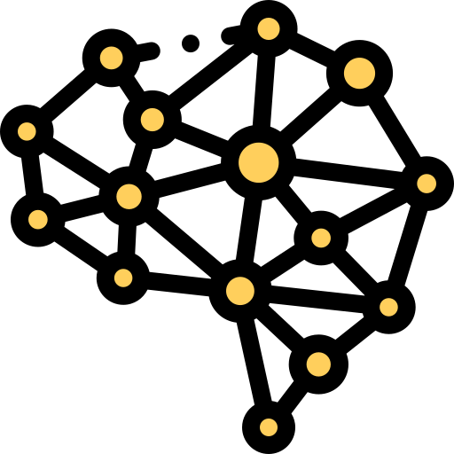
        Awesome Latent Space
    </h1>

    
    
    
    

This repository manually collects works in **latent space**, which will be continuously updated.

## 📖News
**[2025/11/30]** We release the initial version!

## 🌟 Overview
Here, we classify all the latent space based methods two categories, and sort by date in ascending order:
- [📖 News](#news)
- [🌟 Overview](#-overview)
- [🤝 Contact](#-contact)
- [🔥 Methods](#-methods)
  - [Text-based](#text-based)
  - [Visual-based](#visual-based)

## 🤝 Contributing
We warmly welcome contributions of excellent resources you find via **pull request**. Please follow the instruction in **CONTRIBUTING.md** if you want to make one.
Additionally, if you want to have any other issue, please add this wechat group.

## 🔥 Methods
### Text-based

| Date     | Paper Title                                                                                                                                                                                                    | Introduction                                             | Code                                                                                       |
|----------|----------------------------------------------------------------------------------------------------------------------------------------------------------------------------------------------------------------|----------------------------------------------------------|--------------------------------------------------------------------------------------------|
| 2024/12  | [Training Large Language Models to Reason in a Continuous Latent Space](https://arxiv.org/abs/2412.06769)                                                                                                      |       | [Github](https://github.com/facebookresearch/coconut)                                      |
| 2024/12  |    [Deliberation in Latent Space via Differentiable Cache Augmentation](https://arxiv.org/abs/2412.17747)                                           |  | -                                                                                          |
| 2025/02  |    [Reasoning with Latent Thoughts: On the Power of Looped Transformers](https://arxiv.org/pdf/2502.17416)                                          |     | -                                                                                          |
| 2025/02  |    [SoftCoT: Soft Chain-of-Thought for Efficient Reasoning with LLMs](https://arxiv.org/abs/2502.12134)                                               |      | [Github](https://github.com/xuyige/SoftCoT)                                                |
| 2025/02  |     [CODI: Compressing Chain-of-Thought into Continuous Space via Self-Distillation](https://arxiv.org/abs/2502.21074)                            |          | [Github](https://github.com/zhenyi4/codi)                                                  |
| 2025/02  |    [Token Assorted: Mixing Latent and Text Tokens for Improved Language Model Reasoning](https://arxiv.org/abs/2502.03275)                          | 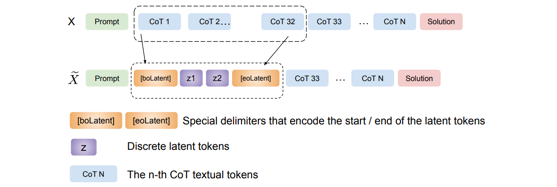        | -                                                                                          |
| 2025/03  |    [Reasoning to Learn from Latent Thoughts](https://arxiv.org/abs/2503.18866?)                                                                     | 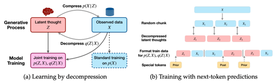         | [Github](https://github.com/ryoungj/BoLT)                                                  |
| 2025/05  |    [Think Silently, Think Fast: Dynamic Latent Compression of LLM Reasoning Chains](https://arxiv.org/abs/2505.16552)                         |         | [Github](https://github.com/xiaomi-research/colar)                                         |
| 2025/05  |    [Soft Reasoning: Navigating Solution Spaces in Large Language Models through Controlled Embedding Exploration](https://arxiv.org/abs/2505.24688) | 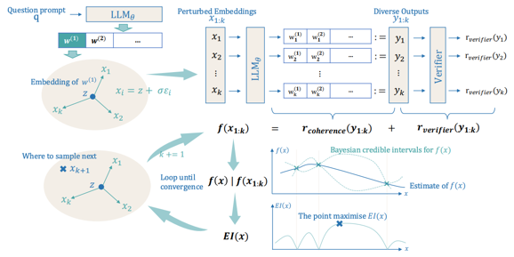         | [Github](https://github.com/alickzhu/Soft-Reasoning)                                       |
| 2025/05  | [Seek in the Dark: Reasoning via Test-Time Instance-Level Policy Gradient in Latent Space](https://arxiv.org/abs/2505.13308)                                                                                   |   | [Github](https://github.com/bigai-nlco/LatentSeekhttps://github.com/bigai-nlco/LatentSeek) |             
| 2025/08  | [Bridging Search and Recommendation through Latent Cross Reasoning](https://www.arxiv.org/abs/2508.04152)                                                                                                      |       | -                                                                                          |
| 2025/09  | [Enhancing Latent Computation in Transformers with Latent Tokens](https://arxiv.org/abs/2505.12629)                                                                                                            | 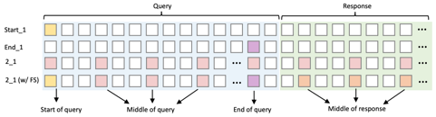    | -                                                                                          |                                                                               
| 2025/09  | [MemGen: Weaving Generative Latent Memory for Self-Evolving Agents](https://arxiv.org/abs/2509.24704)                                                                                                          | 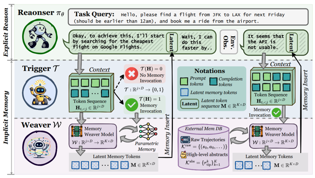       | [Github](https://github.com/KANABOON1/MemGen)                                              |
| 2025/09  | [SIM-CoT: Supervised Implicit Chain-of-Thought](https://arxiv.org/abs/2509.20317)                                                                                                                              |       | [Github](https://github.com/InternLM/SIM-CoT)                                              |
| 2025/09  | [MARCOS: Deep Thinking by Markov Chain of Continuous Thoughts](https://arxiv.org/abs/2509.25020)                                                                                                               |        | -                                                                                          |
| 2025/10  | [Latent Reasoning in LLMs as a Vocabulary-Space Superposition](https://arxiv.org/abs/2510.15522)                                                                                                               | 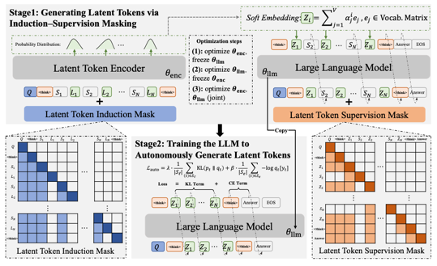   | [Github](https://github.com/DJC-GO-SOLO/Latent-SFT)                                        |
| 2025/10  | [LaDiR: Latent Diffusion Enhances LLMs for Text Reasoning](https://arxiv.org/pdf/2510.04573)                                                                                                                   | 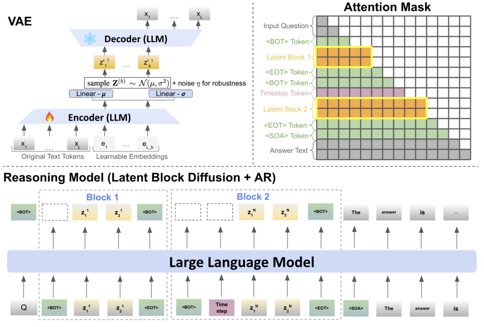        | [Github](https://github.com/mk322/LaDiR)                                                   | 
| 2025/10  | [SemCoT: Accelerating Chain-of-Thought Reasoning through Semantically-Aligned Implicit Tokens](https://arxiv.org/abs/2510.24940)                                                                               |       | [Github](https://github.com/YinhanHe123/SemCoT)                                            |
| 2025/11  | [CLaRa: Bridging Retrieval and Generation with Continuous Latent Reasoning](https://arxiv.org/abs/2511.18659)                                                                                                  |         | [Github](https://github.com/apple/ml-clara)                                                | 
| 2025/11  | [Latent Collaboration in Multi-Agent Systems](https://arxiv.org/abs/2511.20639)                                                                                                                                | 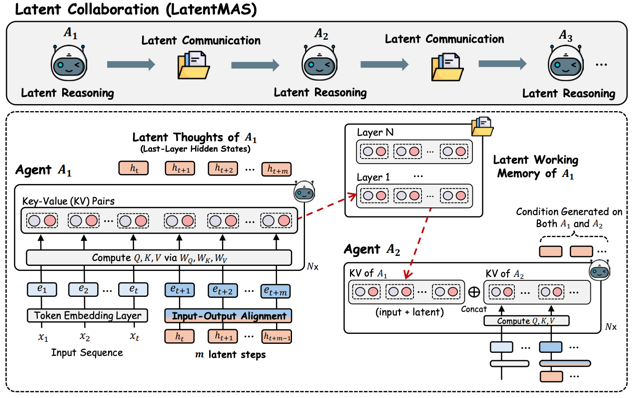   | [Github](https://github.com/Gen-Verse/LatentMAS)                                           |
| 2025/11  | [Think-at-Hard: Selective Latent Iterations to Improve Reasoning Language Models](https://arxiv.org/abs/2511.08577)                                                                                            |           | [Github](https://github.com/thu-nics/TaH)                                                  |

### Visual-based

| Date      | Paper Title                                                                                                                                                                | Introduction                                          | Code                                                          |
|-----------|----------------------------------------------------------------------------------------------------------------------------------------------------------------------------|-------------------------------------------------------|---------------------------------------------------------------|
| 2024/12   |    [Perception Tokens Enhance Visual Reasoning in Multimodal Language Models](https://arxiv.org/abs/2412.03548) | 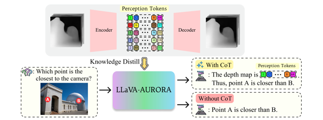    | [Github](https://github.com/mahtabbigverdi/Aurora-perception) |
| 2025/06   | [Machine Mental Imagery: Empower Multimodal Reasoning with Latent Visual Tokens](https://arxiv.org/abs/2506.17218)                                                         |     | [Github](https://github.com/UMass-Embodied-AGI/Mirage)        |
| 2025/09   | [Latent Visual reasoning](https://arxiv.org/abs/2509.24251)                                                                                                                | 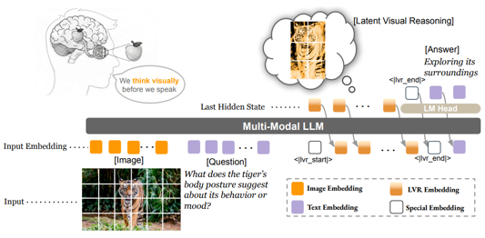       | -                                                             |
| 2025/10   | [Latent Chain-of-Thought for Visual Reasoning](https://arxiv.org/abs/2510.23925)                                                                                           | 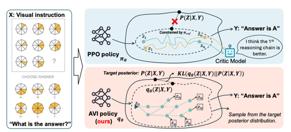     | [Github](https://github.com/heliossun/LaCoT)                  |
| 2025/10   | [Think with 3D: Geometric Imagination Grounded Spatial Reasoning from Limited Views](https://arxiv.org/abs/2510.18632)                                                     |      | [Github](https://github.com/zhangquanchen/3DThinker)          |
| 2025/10   | [Latent Sketchpad: Sketching Visual Thoughts to Elicit Multimodal Reasoning in MLLMs](https://arxiv.org/abs/2510.24514)                                                    |  | [Github](https://github.com/hwanyu112/Latent-Sketchpad)       |
| 2025/11   | [VisMem: Latent Vision Memory Unlocks Potential of Vision-Language Model](https://www.arxiv.org/abs/2511.11007)                                                            | 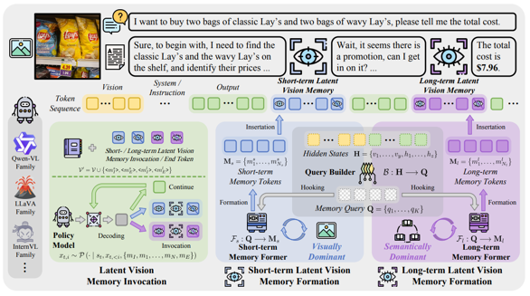    | [Github](https://github.com/YU-deep/VisMem)                   |
| 2025/11   | [Chain-of-Visual-Thought: Teaching VLMs to See and Think Better with Continuous Visual Tokens](https://arxiv.org/abs/2511.19418)                                           |       | [Github](https://github.com/Wakals/CoVT)                      |
| 2025/11   | [Monet: Reasoning in Latent Visual Space Beyond Image and Language](https://arxiv.org/abs/2511.21395)                                                                      |      | [Github](https://github.com/NOVAglow646/)                     |

