

    <h1 style="display: inline-flex; align-items: center;">
        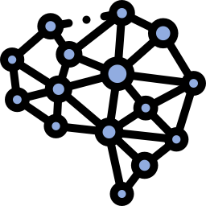
        Awesome Latent Space
    </h1>

    
    
    
    
    

This repository manually collects works in **latent space**, which will be continuously updated.

## 📖 News
**[2025/11/30]** We release the initial version!

## 🌟 Overview
- [📖 News](#-news)
- [🌟 Overview](#-overview)
- [🤝 Contributing](#-contributing)
- [🔥 Methods](#-methods)
  - [Large-Language-Model](#large-language-model)
  - [Vision-Language-Model](#vision-language-model)
  - [Multi-Agent-System](#multi-agent-system)
  - [Vision-Language-Action-Model](#vision-language-action-model)

## 🤝 Contributing
We warmly welcome contributions of excellent resources you find via **pull request**. Please follow the instruction in **CONTRIBUTING.md** if you want to make one.
Additionally, if you want to have any other issue, please add our wechat group.

## 🔥 Methods
### Large-Language-Model
| Date     | Paper Title                                                                                                                                                                                                                 | Introduction                                                              | Code                                                                                                                      |
|----------|-----------------------------------------------------------------------------------------------------------------------------------------------------------------------------------------------------------------------------|---------------------------------------------------------------------------|---------------------------------------------------------------------------------------------------------------------------|
| 2024/11  | [Language Models are Hidden Reasoners: Unlocking Latent Reasoning Capabilities via Self-Rewarding](https://arxiv.org/abs/2411.04282)                                                                                        |                 | [Github](https://github.com/SalesforceAIResearch/LaTRO)                                                                   |
| 2024/12  |    [Training Large Language Models to Reason in a Continuous Latent Space](https://arxiv.org/abs/2412.06769)                                                     |               | [Github](https://github.com/facebookresearch/coconut)                                                                     |
| 2024/12  |    [Deliberation in Latent Space via Differentiable Cache Augmentation](https://arxiv.org/abs/2412.17747)                                                        |          | -                                                                                                                         |
| 2025/01  | [Latent-space adversarial training with post-aware calibration for defending large language models against jailbreak attacks](https://arxiv.org/abs/2501.10639)                                                             |                 | [Github](https://github.com/xinykou/Against_Jailbreak)                                                                    |
| 2025/01  | [LF-Steering: Latent Feature Activation Steering for Enhancing Semantic Consistency in Large Language Models](https://arxiv.org/abs/2501.11036)                                                                             |           | -                                                                                                                         |
| 2025/01  | [DarkMind: Latent Chain-of-Thought Backdoor in Customized LLMs](https://arxiv.org/abs/2501.18617)                                                                                                                           |             | -                                                                                                                         |
| 2025/02  |    [Token Assorted: Mixing Latent and Text Tokens for Improved Language Model Reasoning](https://arxiv.org/abs/2502.03275)                                       |                 | -                                                                                                                         |
| 2025/02  |    [Learning Strategic Language Agents in the Werewolf Game with Iterative Latent Space Policy Optimization](https://arxiv.org/abs/2502.04686)                   | 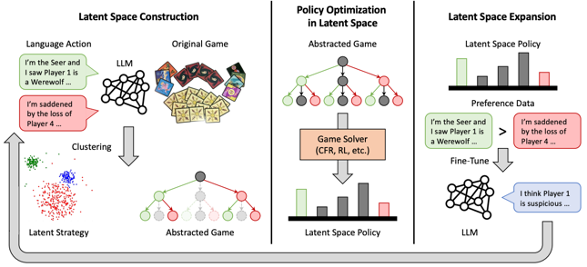                 | -                                                                                                                         |
| 2025/02  |    [Scaling up Test-Time Compute with Latent Reasoning: A Recurrent Depth Approach](https://arxiv.org/abs/2502.05171)                                      |               | [Github](https://github.com/seal-rg/recurrent-pretraining)                                                                |
| 2025/02  |    [SoftCoT: Soft Chain-of-Thought for Efficient Reasoning with LLMs](https://arxiv.org/abs/2502.12134)                                                            |              | [Github](https://github.com/xuyige/SoftCoT)                                                                               |
| 2025/02  | [Human Preferences in Large Language Model Latent Space: A Technical Analysis on the Reliability of Synthetic Data in Voting Outcome Prediction](https://arxiv.org/abs/2502.16280)                                          | 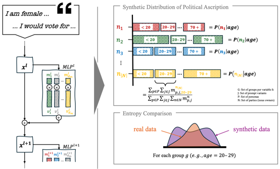                | -                                                                                                                         |
| 2025/02  |    [Reasoning with Latent Thoughts: On the Power of Looped Transformers](https://arxiv.org/abs/2502.17416)                                                       |             | -                                                                                                                         |
| 2025/02  | [Beyond Words: A Latent Memory Approach to Internal Reasoning in LLMs](https://arxiv.org/abs/2502.21030)                                                                                                                    | 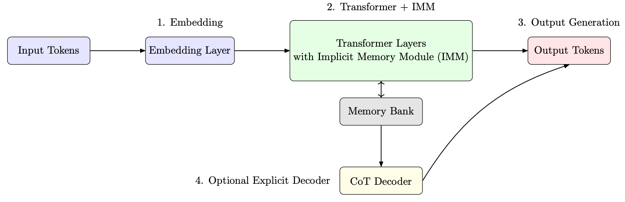             | -                                                                                                                         |
| 2025/02  |     [CODI: Compressing Chain-of-Thought into Continuous Space via Self-Distillation](https://arxiv.org/abs/2502.21074)                                         |                  | [Github](https://github.com/zhenyi4/codi)                                                                                 |
| 2025/03  |    [Reasoning to Learn from Latent Thoughts](https://arxiv.org/abs/2503.18866)                                                                                   |                  | [Github](https://github.com/ryoungj/BoLT)                                                                                 |
| 2025/03  | [Think Before Recommend: Unleashing the Latent Reasoning Power for Sequential Recommendation](https://arxiv.org/abs/2503.22675)                                                                                             |                | -                                                                                                                         |
| 2025/03  | [MoLAE: Mixture of Latent Experts for Parameter-Efficient Language Models](https://arxiv.org/abs/2503.23100)                                                                                                                | 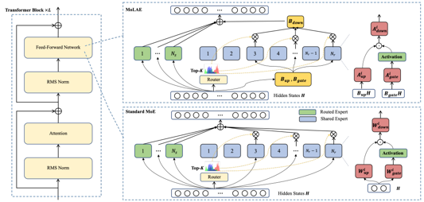                | -                                                                                                                         |
| 2025/04  | [Efficient Pretraining Length Scaling](https://arxiv.org/abs/2504.14992)                                                                                                                                                    |                   | -                                                                                                                         |
| 2025/05  | [SoftCoT++: Test-Time Scaling with Soft Chain-of-Thought Reasoning](https://arxiv.org/abs/2505.11484)                                                                                                                       |         | [Github](https://github.com/xuyige/SoftCoT)                                                                               |
| 2025/05  |    [Reasoning by Superposition: A Theoretical Perspective on Chain of Continuous Thought](https://arxiv.org/abs/2505.12514)                                |             | [Github](https://github.com/Ber666/reasoning-by-superposition)                                                            |
| 2025/05  | [Enhancing Latent Computation in Transformers with Latent Tokens](https://arxiv.org/abs/2505.12629)                                                                                                                         |             | -                                                                                                                         |                                                                               
| 2025/05  | [Seek in the Dark: Reasoning via Test-Time Instance-Level Policy Gradient in Latent Space](https://arxiv.org/abs/2505.13308)                                                                                                |           | [Github](https://github.com/bigai-nlco/LatentSeekhttps://github.com/bigai-nlco/LatentSeek)                                |         
| 2025/05  | [Internal Chain-of-Thought: Empirical Evidence for Layer-wise Subtask Scheduling in LLMs](https://arxiv.org/abs/2505.14530)                                                                                                 |              | [Github](https://github.com/yzp11/Internal-Chain-of-Thought)                                                              |
| 2025/05  |    [Think Silently, Think Fast: Dynamic Latent Compression of LLM Reasoning Chains](https://arxiv.org/abs/2505.16552)                                      |                 | [Github](https://github.com/xiaomi-research/colar)                                                                        |
| 2025/05  | [LARES: Latent Reasoning for Sequential Recommendation](https://arxiv.org/abs/2505.16865)                                                                                                                                   |                 | -                                                                                                                         |
| 2025/05  |    [Hybrid Latent Reasoning via Reinforcement Learning](https://arxiv.org/abs/2505.18454)                                                                  |                  | [Github](https://github.com/thu-nics/C2C)                                                                                 |
| 2025/05  |    [System-1.5 Reasoning: Traversal in Language and Latent Spaces with Dynamic Shortcuts](https://arxiv.org/abs/2505.18962)                                |             | -                                                                                                                         |
| 2025/05  |    [Reinforced Latent Reasoning for LLM-based Recommendation](https://arxiv.org/abs/2505.19092)                                                                  |                    | [Github](https://github.com/xuwenxinedu/R3)                                                                               |
| 2025/05  |    [Soft Reasoning: Navigating Solution Spaces in Large Language Models through Controlled Embedding Exploration](https://arxiv.org/abs/2505.24688)              |                  | [Github](https://github.com/alickzhu/Soft-Reasoning)                                                                      |
| 2025/06  | [Efficient Post-Training Refinement of Latent Reasoning in Large Language Models](https://arxiv.org/abs/2506.08552)                                                                                                         |             | [Github](https://github.com/anord-wang/Lateng-Reasoning)                                                                  |
| 2025/07  |    [Latent Inter-User Difference Modeling for LLM Personalization](https://arxiv.org/abs/2507.20849)                                                           |                   | [Github](https://github.com/SnowCharmQ/DEP)                                                                               |
| 2025/08  | [Bridging Search and Recommendation through Latent Cross Reasoning](https://arxiv.org/abs/2508.04152)                                                                                                                       |               | -                                                                                                                         |
| 2025/08  | [Latent Fusion Jailbreak: Blending Harmful and Harmless Representations to Elicit Unsafe LLM Outputs](https://arxiv.org/abs/2508.10029)                                                                                     | 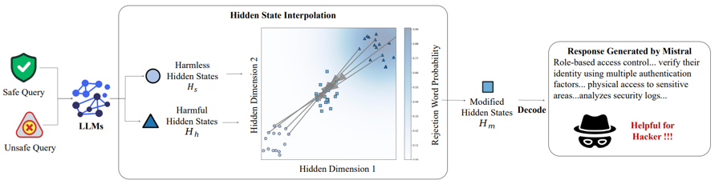                  | -                                                                                                                         |
| 2025/09  | [Decoding in Latent Spaces for Efficient Inference in LLM-based Recommendation](https://arxiv.org/abs/2509.11524)                                                                                                           |                   | -                                                                                                                         |
| 2025/09  | [LTA-thinker: Latent Thought-Augmented Training Framework for Large Language Models on Complex Reasoning](https://arxiv.org/abs/2509.12875)                                                                                 |           | [Github](https://github.com/wangjiaqi886/LTA-Thinker)                                                                     |
| 2025/09  | [Latent learning: episodic memory complements parametric learning by enabling flexible reuse of experiences](https://arxiv.org/abs/2509.16189)                                                                              | 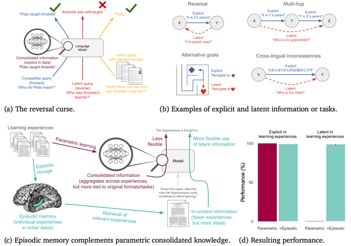               | -                                                                                                                         |
| 2025/09  |    [SIM-CoT: Supervised Implicit Chain-of-Thought](https://arxiv.org/abs/2509.20317)                                                                             |               | [Github](https://github.com/InternLM/SIM-CoT)                                                                             |
| 2025/09  | [Pretraining LLM with Latent Thoughts in Continuous Space](https://arxiv.org/abs/2509.23184)                                                                                                                                |             | [Github](https://github.com/LUMIA-Group/PonderLM-2)                                                                       |
| 2025/09  | [Learning to Ponder: Adaptive Reasoning in Latent Space](https://arxiv.org/abs/2509.24238)                                                                                                                                  |             | -                                                                                                                         |
| 2025/09  | [Identity Bridge: Enabling Implicit Reasoning via Shared Latent Memory](https://arxiv.org/abs/2509.24653)                                                                                                                   |              | -                                                                                                                         |
| 2025/09  |    [MemGen: Weaving Generative Latent Memory for Self-Evolving Agents](https://arxiv.org/abs/2509.24704)                                                         |                | [Github](https://github.com/KANABOON1/MemGen)                                                                             |
| 2025/09  | [LatentEvolve: Self-Evolving Test-Time Scaling in Latent Space](https://arxiv.org/abs/2509.24771)                                                                                                                           |         | [Github](https://github.com/jins7/LatentEvolve)                                                                           |
| 2025/09  | [MARCOS: Deep Thinking by Markov Chain of Continuous Thoughts](https://arxiv.org/abs/2509.25020)                                                                                                                            |                | -                                                                                                                         |
| 2025/09  | [A Formal Comparison Between Chain of Thought and Latent Thought](https://arxiv.org/abs/2509.25239)                                                                                                                         |                | -                                                                                                                         | 
| 2025/09  |    [Latent Thinking Optimization: Your Latent Reasoning Language Model Secretly Encodes Reward Signals in Its Latent Thoughts](https://arxiv.org/abs/2509.26314) |                | -                                                                                                                         |
| 2025/10  | [Thoughtbubbles: an Unsupervised Method for Parallel Thinking in Latent Space](https://arxiv.org/abs/2510.00219)                                                                                                            |       | [Github](https://github.com/stanfordnlp/thoughtbubbles)                                                                   |
| 2025/10  | [Analyzing Latent Concepts in Code Language Models](https://arxiv.org/abs/2510.00476)                                                                                                                                       |                 | -                                                                                                                         |
| 2025/10  | [Exploring System 1 and 2 communication for latent reasoning in LLMs](https://arxiv.org/abs/2510.00494)                                                                                                                     |             | -                                                                                                                         |
| 2025/10  |    [KaVa: Latent Reasoning via Compressed KV-Cache Distillation](https://arxiv.org/abs/2510.02312)                                                               |                  | -                                                                                                                         |
| 2025/10  |    [Thinking on the Fly: Test-Time Reasoning Enhancement via Latent Thought Policy Optimization](https://arxiv.org/abs/2510.04182)                               |                  | [Github](https://github.com/ltpo2025/LTPO)                                                                                |
| 2025/10  |    [LaDiR: Latent Diffusion Enhances LLMs for Text Reasoning](https://arxiv.org/abs/2510.04573)                                                                  |                 | [Github](https://github.com/mk322/LaDiR)                                                                                  | 
| 2025/10  |    [SwiReasoning: Switch-Thinking in Latent and Explicit for Pareto-Superior Reasoning LLMs](https://arxiv.org/abs/2510.05069)                                   |        | [Github](https://github.com/sdc17/SwiReasoning)                                                                           |
| 2025/10  | [Encode, Think, Decode: Scaling test-time reasoning with recursive latent thoughts](https://arxiv.org/abs/2510.07358)                                                                                                       |                   | -                                                                                                                         |
| 2025/10  | [Parallel Test-Time Scaling for Latent Reasoning Models](https://arxiv.org/abs/2510.07745)                                                                                                                                  |                   | [Github](https://github.com/YRYangang/LatentTTS)                                                                          |
| 2025/10  | [Tracing the Traces: Latent Temporal Signals for Efficient and Accurate Reasoning](https://arxiv.org/abs/2510.10494)                                                                                                        | 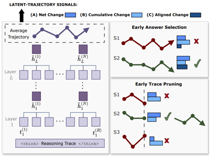    | -                                                                                                                         |
| 2025/10  | [Unlocking Out-of-Distribution Generalization in Transformers via Recursive Latent Space Reasoning](https://arxiv.org/abs/2510.14095)                                                                                       |                   | [Github](https://github.com/Awni00/algorithmic-generalization-transformer-architectures)                                  |
| 2025/10  | [Language Models are Injective and Hence Invertible](https://arxiv.org/abs/2510.15511)                                                                                                                                      | 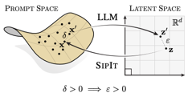             | -                                                                                                                         |
| 2025/10  | [Latent Reasoning in LLMs as a Vocabulary-Space Superposition](https://arxiv.org/abs/2510.15522)                                                                                                                            | 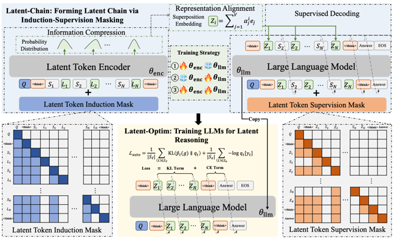           | [Github](https://github.com/DJC-GO-SOLO/Latent-SFT)                                                                       |
| 2025/10  |    [ActivationReasoning: Logical Reasoning in Latent Activation Spaces](https://arxiv.org/abs/2510.18184)                                                        |  | -                                                                                                                         |
| 2025/10  |    [SALS: Sparse Attention in Latent Space for KV cache Compression](https://arxiv.org/abs/2510.24273)                                                     |                  | -                                                                                                                         |
| 2025/10  |    [SemCoT: Accelerating Chain-of-Thought Reasoning through Semantically-Aligned Implicit Tokens](https://arxiv.org/abs/2510.24940)                        |               | [Github](https://github.com/YinhanHe123/SemCoT)                                                                           |
| 2025/10  | [Scaling Latent Reasoning via Looped Language Models](https://arxiv.org/abs/2510.25741)                                                                                                                                     |                  | -                                                                                                                         |
| 2025/11  | [SofT-GRPO: Surpassing Discrete-Token LLM Reinforcement Learning via Gumbel-Reparameterized Soft-Thinking Policy Optimization](https://arxiv.org/abs/2511.06411)                                                            |              | [Github](https://github.com/zz1358m/SofT-GRPO-master)                                                                     |
| 2025/11  | [Think-at-Hard: Selective Latent Iterations to Improve Reasoning Language Models](https://arxiv.org/abs/2511.08577)                                                                                                         |                   | [Github](https://github.com/apple/ml-clara)                                                                               | 
| 2025/11  | [SpiralThinker: Latent Reasoning through an Iterative Process with Text-Latent Interleaving](https://arxiv.org/abs/2511.08983)                                                                                              |        | -                                                                                                                         |
| 2025/11  | [Improving Latent Reasoning in LLMs via Soft Concept Mixing](https://arxiv.org/abs/2511.16885)                                                                                                                              |                   | -                                                                                                                         |
| 2025/11  | [CLaRa: Bridging Retrieval and Generation with Continuous Latent Reasoning](https://arxiv.org/abs/2511.18659)                                                                                                               |                 | [Github](https://github.com/apple/ml-clara)                                                                               | 
| 2025/11  | [Learning When to Stop: Adaptive Latent Reasoning via Reinforcement Learning](https://arxiv.org/abs/2511.21581)                                                                                                             |              | [Github](https://github.com/apning/adaptive-latent-reasoning)                                                             |
| 2025/11  | [Visualizing LLM Latent Space Geometry Through Dimensionality Reduction](https://arxiv.org/abs/2511.21594)                                                                                                                  | 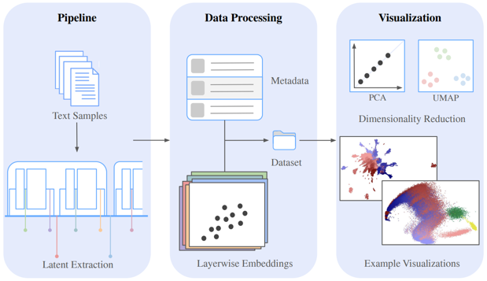        | [Github](https://github.com/Vainateya/Feature_Geometry_Visualization)                                                     |
| 2025/11  | [Polarity-Aware Probing for Quantifying Latent Alignment in Language Models](https://arxiv.org/abs/2511.21737)                                                                                                              |                | [Github](https://github.com/SadSabrina/polarity-probing)                                                                  |
| 2025/12  | [SynthStrategy: Extracting and Formalizing Latent Strategic Insights from LLMs in Organic Chemistry](https://arxiv.org/abs/2512.01507)                                                                                      |        | -                                                                                                                         |
| 2025/12  | [Latent Debate: A Surrogate Framework for Interpreting LLM Thinking](https://arxiv.org/abs/2512.01909)                                                                                                                      |                | [Github](https://github.com/tigerchen52/latent_debate)                                                                    |
| 2025/12  | [Lightweight Latent Reasoning for Narrative Tasks](https://arxiv.org/abs/2512.02240)                                                                                                                                        |           | -                                                                                                                         |
| 2025/12  | [ReLaX: Reasoning with Latent Exploration for Large Reasoning Models](https://arxiv.org/abs/2512.07558)                                                                                                                     |                 | -                                                                                                                         |
| 2025/12  | [ESS: An Offload-Centric Latent-Cache Management Architecture for DeepSeek-V3.2-Exp](https://arxiv.org/abs/2512.10576)                                                                                                      |                   | -                                                                                                                         |
| 2025/12  | [Reinforcement Learning for Latent-Space Thinking in LLMs](https://arxiv.org/abs/2512.11816)                                                                                                                                |         | [Github](https://github.com/enesozeren/latent-space-thinking-model)                                                       |
| 2025/12  | [Reasoning Palette: Modulating Reasoning via Latent Contextualization for Controllable Exploration for (V)LMs](https://arxiv.org/abs/2512.17206)                                                                            |                  | -                                                                                                                         |
| 2025/12  | [JEPA-Reasoner: Decoupling Latent Reasoning from Token Generation](https://arxiv.org/abs/2512.19171)                                                                                                                        |         | -                                                                                                                         |
| 2025/12  | [iCLP: Large Language Model Reasoning with Implicit Cognition Latent Planning](https://arxiv.org/abs/2512.24014)                                                                                                            |                  | [Github](https://github.com/AgenticFinLab/latent-planning)                                                                |
| 2025/12  | [Dynamic Large Concept Models: Latent Reasoning in an Adaptive Semantic Space](https://arxiv.org/abs/2512.24617)                                                                                                            |                  | -                                                                                                                         |
| 2026/01  | [Parallel Latent Reasoning for Sequential Recommendation](https://arxiv.org/abs/2601.03153)                                                                                                                                 |                   | -                                                                                                                         |
| 2026/01  | [Layer-Order Inversion: Rethinking Latent Multi-Hop Reasoning in Large Language Models](https://arxiv.org/abs/2601.03542)                                                                                                   |                 | [Github](https://github.com/laquabe/Layer-Order-Inversion)                                                                |
| 2026/01  | [FlashMem: Distilling Intrinsic Latent Memory via Computation Reuse](https://arxiv.org/abs/2601.05505)                                                                                                                      |              | -                                                                                                                         |
| 2026/01  | [IIB-LPO: Latent Policy Optimization via Iterative Information Bottleneck](https://arxiv.org/abs/2601.05870)                                                                                                                |               | [Github](https://github.com/denghuilin-cyber/IIB-LPO)                                                                     |
| 2026/01  | [Breaking Model Lock-in: Cost-Efficient Zero-Shot LLM Routing via a Universal Latent Space](https://arxiv.org/abs/2601.06220)                                                                                               |           | [Github](https://github.com/Codeffun3/ZeroRouter)                                                                         |
| 2026/01  | [Silence the Judge: Reinforcement Learning with Self-Verifier via Latent Geometric Clustering](https://arxiv.org/abs/2601.08427)                                                                                            |           | -                                                                                                                         |
| 2026/01  | [Reasoning Beyond Chain-of-Thought: A Latent Computational Mode in Large Language Models](https://arxiv.org/abs/2601.08058)                                                                                                 |             | -                                                                                                                         |
| 2026/01  | [RISER: Orchestrating Latent Reasoning Skills for Adaptive Activation Steering](https://arxiv.org/abs/2601.09269)                                                                                                           |                 | [Github](https://github.com/gooogleshanghai/RISER-Orchestrating-Latent-Reasoning-Skills-for-Adaptive-Activation-Steering) |
| 2026/01  | [GeoSteer: Faithful Chain-of-Thought Steering via Latent Manifold Gradients](https://arxiv.org/abs/2601.10229)                                                                                                              |              | -                                                                                                                         |
| 2026/01  | [Reasoning While Recommending: Entropy-Guided Latent Reasoning in Generative Re-ranking Models](https://arxiv.org/abs/2601.13533)                                                                                           |                  | -                                                                                                                         |
| 2026/01  | [Latent-Space Contrastive Reinforcement Learning for Stable and Efficient LLM Reasoning](https://arxiv.org/abs/2601.17275)                                                                                                  |                   | -                                                                                                                         |
| 2026/01  | [UniCog: Uncovering Cognitive Abilities of LLMs through Latent Mind Space Analysis](https://arxiv.org/abs/2601.17897)                                                                                                       |                | [Github](https://github.com/milksalute/unicog)                                                                            |
| 2026/01  | [S2GR: Stepwise Semantic-Guided Reasoning in Latent Space for Generative Recommendation](https://arxiv.org/abs/2601.18664)                                                                                                  |                  | -                                                                                                                         |
| 2026/01  | [The Geometric Reasoner: Manifold-Informed Latent Foresight Search for Long-Context Reasoning](https://arxiv.org/abs/2601.18832)                                                                                            |                   | -                                                                                                                         |
| 2026/01  | [PILOT: Planning via Internalized Latent Optimization Trajectories for Large Language Models](https://arxiv.org/abs/2601.19917)                                                                                             |                 | -                                                                                                                         |
| 2026/01  | [Beyond Imitation: Reinforcement Learning for Active Latent Planning](https://arxiv.org/abs/2601.21598)                                                                                                                     |            | [Github](https://github.com/zz1358m/ATP-Latent-master)                                                                    |
| 2026/01  | [Latent Adversarial Regularization for Offline Preference Optimization](https://arxiv.org/abs/2601.22083)                                                                                                                   |                 | -                                                                                                                         |
| 2026/01  | [Latent Chain-of-Thought as Planning: Decoupling Reasoning from Verbalization](https://arxiv.org/abs/2601.21358)                                                                                                            |                  | [Github](https://github.com/yunsaijc/PLaT)                                                                                |
| 2026/01  | [Depth-Recurrent Attention Mixtures: Giving Latent Reasoning the Attention it Deserves](https://arxiv.org/abs/2601.21582)                                                                                                   |               | -                                                                                                                         |
| 2026/01  | [From Logits to Latents: Contrastive Representation Shaping for LLM Unlearning](https://arxiv.org/abs/2601.22028)                                                                                                           | -                                                                         | -                                                                                                                         |
| 2026/01  | [ReGuLaR: Variational Latent Reasoning Guided by Rendered Chain-of-Thought](https://arxiv.org/abs/2601.23184)                                                                                                               |               | [Github](https://github.com/FanmengWang/ReGuLaR)                                                                          |
| 2026/02  | [G-MemLLM: Gated Latent Memory Augmentation for Long-Context Reasoning in Large Language Models](https://arxiv.org/abs/2602.00015)                                                                                          |               | -                                                                                                                         |
| 2026/02  | [Do Latent-CoT Models Think Step-by-Step? A Mechanistic Study on Sequential Reasoning Tasks](https://arxiv.org/abs/2602.00449)                                                                                              |                  | [Github](https://github.com/jialiang19/latent-cot-thinking)                                                               |
| 2026/02  | [Capabilities and Fundamental Limits of Latent Chain-of-Thought](https://arxiv.org/abs/2602.01148)                                                                                                                          | -                                                                         | -                                                                                                                         |
| 2026/02  | [Restoring Exploration after Post-Training: Latent Exploration Decoding for Large Reasoning Models](https://arxiv.org/abs/2602.01698)                                                                                       |                   | [Github](https://github.com/Xiaomi-Research/LED)                                                                          |
| 2026/02  | [No Global Plan in Chain-of-Thought: Uncover the Latent Planning Horizon of LLMs](https://arxiv.org/abs/2602.02103)                                                                                                         | -                                                                         | [Github](https://github.com/lxucs/tele-lens)                                                                              |
| 2026/02  | [CoLT: Reasoning with Chain of Latent Tool Calls](https://arxiv.org/abs/2602.04246)                                                                                                                                         |                  | -                                                                                                                         |
| 2026/02  | [Internalizing LLM Reasoning via Discovery and Replay of Latent Actions](https://arxiv.org/abs/2602.04925)                                                                                                                  |                  | [Github](https://github.com/sznnzs/LLM-Latent-Action)                                                                     |
| 2026/02  | [Inference-Time Rethinking with Latent Thought Vectors for Math Reasoning](https://arxiv.org/abs/2602.06584)                                                                                                                |             | -                                                                                                                         |
| 2026/02  | [LatentChem: From Textual CoT to Latent Thinking in Chemical Reasoning](https://arxiv.org/abs/2602.07075)                                                                                                                   |           | [Github](https://github.com/xinwuye/LatentChem)                                                                           |
| 2026/02  | [DeltaKV: Residual-Based KV Cache Compression via Long-Range Similarity](https://arxiv.org/abs/2602.08005)                                                                                                                  |              | [Github](https://github.com/CURRENTF/Sparse-vLLM)                                                                         |
| 2026/02  | [Pretraining with Token-Level Adaptive Latent Chain-of-Thought](https://arxiv.org/abs/2602.08220)                                                                                                                           |           | -                                                                                                                         |
| 2026/02  | [Latent Reasoning with Supervised Thinking States](https://arxiv.org/abs/2602.08332)                                                                                                                                        |                | -                                                                                                                         |
| 2026/02  | [Dynamics Within Latent Chain-of-Thought: An Empirical Study of Causal Structure](https://arxiv.org/abs/2602.08783)                                                                                                         |              | -                                                                                                                         |
| 2026/02  | [Next Concept Prediction in Discrete Latent Space Leads to Stronger Language Models](https://arxiv.org/abs/2602.08984)                                                                                                      |            | [Github](https://github.com/LUMIA-Group/ConceptLM)                                                                        |
| 2026/02  | [Talking with the Latents -- how to convert your LLM into an astronomer](https://arxiv.org/abs/2602.09670)                                                                                                                  |               | -                                                                                                                         |
| 2026/02  | [Internalizing Multi-Agent Reasoning for Accurate and Efficient LLM-based Recommendation](https://arxiv.org/abs/2602.09829)                                                                                                 |                  | -                                                                                                                         |
| 2026/02  | [Latent Thoughts Tuning: Bridging Context and Reasoning with Fused Information in Latent Tokens](https://arxiv.org/abs/2602.10229)                                                                                          |             | [Github](https://github.com/NeosKnight233/Latent-Thoughts-Tuning)                                                         |
| 2026/02  | [Prioritize the Process, Not Just the Outcome: Rewarding Latent Thought Trajectories Improves Reasoning in Looped Language Models](https://arxiv.org/abs/2602.10520)                                                        |                  | -                                                                                                                         |
| 2026/02  |    [LoopFormer: Elastic-Depth Looped Transformers for Latent Reasoning via Shortcut Modulation](https://arxiv.org/abs/2602.11451)                                |           | [Github](https://github.com/armenjeddi/loopformer)                                                                        |
| 2026/02  | [Jailbreaking Leaves a Trace: Understanding and Detecting Jailbreak Attacks from Internal Representations of Large Language Models](https://arxiv.org/abs/2602.11495)                                                       |          | -                                                                                                                         |
| 2026/02  |    [Native Reasoning Models: Training Language Models to Reason on Unverifiable Data](https://arxiv.org/abs/2602.11549)                                          |                   | -                                                                                                                         |
| 2026/02  | [ThinkRouter: Efficient Reasoning via Routing Thinking between Latent and Discrete Spaces](https://arxiv.org/abs/2602.11683)                                                                                                |          | -                                                                                                                         |
| 2026/02  | [GTS: Inference-Time Scaling of Latent Reasoning with a Learnable Gaussian Thought Sampler](https://arxiv.org/abs/2602.14077)                                                                                               |                   | -                                                                                                                         |
| 2026/02  | [Measuring and Mitigating Post-hoc Rationalization in Reverse Chain-of-Thought Generation](https://arxiv.org/abs/2602.14469)                                                                                                |                   | -                                                                                                                         |
| 2026/02  | [Inner Loop Inference for Pretrained Transformers: Unlocking Latent Capabilities Without Training](https://arxiv.org/abs/2602.14759)                                                                                        | -                                                                         | [Github](https://github.com/jonathanlys01/looped-transformer)                                                             |

### Vision-Language-Model
| Date    | Paper Title                                                                                                                                                                                                             | Introduction                                                      | Code                                                          |
|---------|-------------------------------------------------------------------------------------------------------------------------------------------------------------------------------------------------------------------------|-------------------------------------------------------------------|---------------------------------------------------------------|
| 2024/12 |    [Perception Tokens Enhance Visual Reasoning in Multimodal Language Models](https://arxiv.org/abs/2412.03548)                                              |        | [Github](https://github.com/mahtabbigverdi/Aurora-perception) |
| 2025/01 | [Efficient Reasoning with Hidden Thinking](https://arxiv.org/abs/2501.19201)                                                                                                                                            |         | [Github](https://github.com/shawnricecake/Heima)              |
| 2025/05 |    [Towards General Continuous Memory for Vision-Language Models](https://arxiv.org/abs/2505.17670)                                                    |         | [Github](https://github.com/WenyiWU0111/CoMEM/tree/main)      |
| 2025/06 | [Machine Mental Imagery: Empower Multimodal Reasoning with Latent Visual Tokens](https://arxiv.org/abs/2506.17218)                                                                                                      |        | [Github](https://github.com/UMass-Embodied-AGI/Mirage)        |
| 2025/08 | [Multimodal Chain of Continuous Thought for Latent-Space Reasoning in Vision-Language Models](https://arxiv.org/abs/2508.12587)                                                                                         |         | -                                                             | 
| 2025/09 |    [The Transfer Neurons Hypothesis: An Underlying Mechanism for Language Latent Space Transitions in Multilingual LLMs](https://arxiv.org/abs/2509.17030) |           | -                                                             |
| 2025/09 |    [Latent Visual reasoning](https://arxiv.org/abs/2509.24251)                                                                                               |           | -                                                             |
| 2025/10 | [Auto-scaling Continuous Memory for GUI Agent](https://arxiv.org/abs/2510.09038)                                                                                                                                        |          | [Github](https://github.com/WenyiWU0111/CoMEM-Agent)          |
| 2025/10 | [Kelp: A Streaming Safeguard for Large Models via Latent Dynamics-Guided Risk Detection](https://arxiv.org/abs/2510.09694)                                                                                              |          | [Github](https://github.com/Alibaba-AAIG/Kelp)                |
| 2025/10 | [Reasoning in the Dark: Interleaved Vision-Text Reasoning in Latent Space](https://arxiv.org/abs/2510.12603)                                                                                                            |        | [Github](https://github.com/FYYDCC/IVT-LR)                    |
| 2025/10 | [Think with 3D: Geometric Imagination Grounded Spatial Reasoning from Limited Views](https://arxiv.org/abs/2510.18632)                                                                                                  |         | [Github](https://github.com/zhangquanchen/3DThinker)          |
| 2025/10 | [Latent Chain-of-Thought for Visual Reasoning](https://arxiv.org/abs/2510.23925)                                                                                                                                        |         | [Github](https://github.com/heliossun/LaCoT)                  |
| 2025/10 | [Latent Sketchpad: Sketching Visual Thoughts to Elicit Multimodal Reasoning in MLLMs](https://arxiv.org/abs/2510.24514)                                                                                                 |     | [Github](https://github.com/hwanyu112/Latent-Sketchpad)       |
| 2025/11 | [Multimodal Reasoning via Latent Refocusing](https://arxiv.org/abs/2511.02360)                                                                                                                                          |          | -                                                             |
| 2025/11 | [VisMem: Latent Vision Memory Unlocks Potential of Vision-Language Model](https://arxiv.org/abs/2511.11007)                                                                                                             |        | [Github](https://github.com/YU-deep/VisMem)                   |
| 2025/11 | [L2V-CoT: Cross-Modal Transfer of Chain-of-Thought Reasoning via Latent Intervention](https://arxiv.org/abs/2511.17910)                                                                                                 |       | -                                                             |
| 2025/11 | [Chain-of-Visual-Thought: Teaching VLMs to See and Think Better with Continuous Visual Tokens](https://arxiv.org/abs/2511.19418)                                                                                        |          | [Github](https://github.com/Wakals/CoVT)                      |
| 2025/11 | [Reading Between the Lines: Abstaining from VLM-Generated OCR Errors via Latent Representation Probes](https://arxiv.org/abs/2511.19806)                                                                                |           | -                                                             |
| 2025/11 | [Monet: Reasoning in Latent Visual Space Beyond Image and Language](https://arxiv.org/abs/2511.21395)                                                                                                                   |         | [Github](https://github.com/NOVAglow646/)                     |
| 2025/12 | [Interleaved Latent Visual Reasoning with Selective Perceptual Modeling](https://arxiv.org/abs/2512.05665)                                                                                                              |          | [Github](https://github.com/XD111ds/ILVR)                     |
| 2025/12 | [Mull-Tokens: Modality-Agnostic Latent Thinking](https://arxiv.org/abs/2512.10941)                                                                                                                                      |          | -                                                             |
| 2025/12 | [Reasoning Within the Mind: Dynamic Multimodal Interleaving in Latent Space](https://arxiv.org/abs/2512.12623)                                                                                                          |          | [Github](https://github.com/eric-ai-lab/DMLR)                 |
| 2025/12 | [Sketch-in-Latents: Eliciting Unified Reasoning in MLLMs](https://arxiv.org/abs/2512.16584)                                                                                                                             |         | [Github](https://github.com/TungChintao/SkiLa)                |
| 2025/12 | [Latent Implicit Visual Reasoning](https://arxiv.org/abs/2512.21218)                                                                                                                                                    |          | -                                                             |
| 2026/01 | [Forest Before Trees: Latent Superposition for Efficient Visual Reasoning](https://arxiv.org/abs/2601.06803)                                                                                                            |         | [Github](https://github.com/ybb6/laser)                       |
| 2026/01 | [Controlling Multimodal Conversational Agents with Coverage-Enhanced Latent Actions](https://arxiv.org/abs/2601.07516)                                                                                                  |   | -                                                             |
| 2026/01 | [LaViT: Aligning Latent Visual Thoughts for Multi-modal Reasoning](https://arxiv.org/abs/2601.10129)                                                                                                                    |         | [Github](https://github.com/Svardfox/LaViT)                   |
| 2026/01 | [Render-of-Thought: Rendering Textual Chain-of-Thought as Images for Visual Latent Reasoning](https://arxiv.org/abs/2601.14750)                                                                                         |           | [Github](https://github.com/TencentBAC/RoT)                   |
| 2026/01 | [CausalEmbed: Auto-Regressive Multi-Vector Generation in Latent Space for Visual Document Embedding](https://arxiv.org/abs/2601.21262)                                                                                  |  | -                                                             |
| 2026/02 | [PolarMem: A Training-Free Polarized Latent Graph Memory for Verifiable Multimodal Agents](https://arxiv.org/abs/2602.00415)                                                                                            |     | [Github](https://github.com/czs-ict/PolarMem)                 |
| 2026/02 | [LatentLens: Revealing Highly Interpretable Visual Tokens in LLMs](https://arxiv.org/abs/2602.00462)                                                                                                                    |   | [Github](https://github.com/McGill-NLP/latentlens)            |
| 2026/02 | [Learning Modal-Mixed Chain-of-Thought Reasoning with Latent Embeddings](https://arxiv.org/abs/2602.00574)                                                                                                              |      | -                                                             |
| 2026/02 | [Toward Cognitive Supersensing in Multimodal Large Language Model](https://arxiv.org/abs/2602.01541)                                                                                                                    |     | [Github](https://github.com/PediaMedAI/Cognition-MLLM)        |
| 2026/02 | [Vision-aligned Latent Reasoning for Multi-modal Large Language Model](https://arxiv.org/abs/2602.04476)                                                                                                                |          | -                                                             |
| 2026/02 | [Multimodal Latent Reasoning via Hierarchical Visual Cues Injection](https://arxiv.org/abs/2602.05359)                                                                                                                  |          | -                                                             |
| 2026/02 | [LCLA: Language-Conditioned Latent Alignment for Vision-Language Navigation](https://arxiv.org/abs/2602.07629)                                                                                                          |          | -                                                             |
| 2026/02 | [MaD-Mix: Multi-Modal Data Mixtures via Latent Space Coupling for Vision-Language Model Training](https://arxiv.org/abs/2602.07790)                                                                                     |       | -                                                             |
| 2026/02 | [Reason-IAD: Knowledge-Guided Dynamic Latent Reasoning for Explainable Industrial Anomaly Detection](https://arxiv.org/abs/2602.09850)                                                                                  |    | [Github](https://github.com/chenpeng052/Reason-IAD)           |
| 2026/02 | [Revis: Sparse Latent Steering to Mitigate Object Hallucination in Large Vision-Language Models](https://arxiv.org/abs/2602.11824)                                                                                      |         | [Github](https://github.com/antgroup/Revis)                   |
| 2026/02 | [OneLatent: Single-Token Compression for Visual Latent Reasoning](https://arxiv.org/abs/2602.13738)                                                                                                                     |    | -                                                             |

### Multi-Agent-System
| Date     | Paper Title                                                                                                                                                                  | Introduction                                                     | Code                                                          |
|----------|------------------------------------------------------------------------------------------------------------------------------------------------------------------------------|------------------------------------------------------------------|---------------------------------------------------------------|
| 2025/10  |    [Cache-to-Cache: Direct Semantic Communication Between Large Language Model](https://arxiv.org/abs/2510.03215) |          | [Github](https://github.com/thu-nics/C2C)                     |
| 2025/10  |    [Thought Communication in Multiagent Collaboration](https://arxiv.org/abs/2510.20733)                    |  | -                                                             |
| 2025/11  | [Enabling Agents to Communicate Entirely in Latent Space](https://arxiv.org/abs/2511.09149)                                                                                  |     | -                                                             |
| 2025/11  | [Latent Collaboration in Multi-Agent Systems](https://arxiv.org/abs/2511.20639)                                                                                              |   | [Github](https://github.com/Gen-Verse/LatentMAS)              |
| 2026/01  | [Latent Space Communication via K-V Cache Alignment](https://arxiv.org/abs/2601.06123)                                                                                       |       | -                                                             |
| 2026/02  | [Dual Latent Memory for Visual Multi-agent System](https://arxiv.org/abs/2602.00471)                                                                                         |      | [Github](https://github.com/YU-deep/L2-VMAS)                  |
| 2026/02  | [LatentMem: Customizing Latent Memory for Multi-Agent Systems](https://arxiv.org/abs/2602.03036)                                                                             | 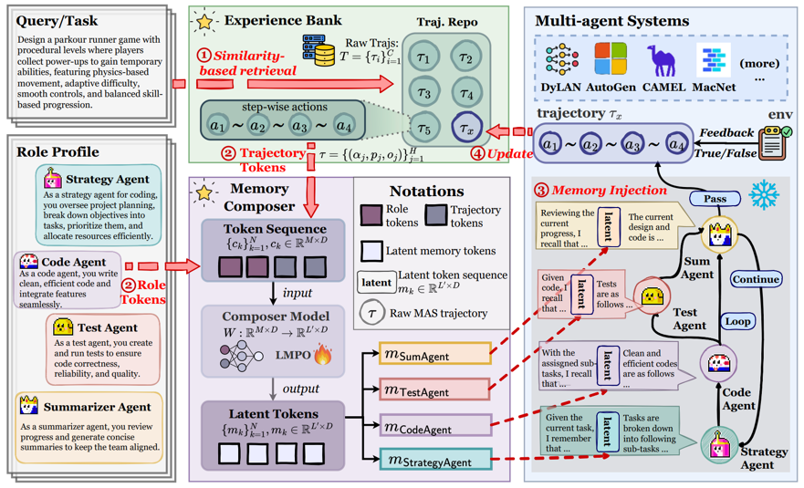  | [Github](https://github.com/KANABOON1/LatentMem)              |                                               
| 2026/02  | [Agent Primitives: Reusable Latent Building Blocks for Multi-Agent Systems](https://arxiv.org/abs/2602.03695)                                                                |        | -                                                             |
| 2026/02  | [The Vision Wormhole: Latent-Space Communication in Heterogeneous Multi-Agent Systems](https://arxiv.org/abs/2602.15382)                                                     |     | [Github](https://github.com/xz-liu/heterogeneous-latent-mas)  |

### Vision-Language-Action-Model
| Date     | Paper Title                                                                                                                                                                              | Introduction                                                             | Code                                                      |
|----------|------------------------------------------------------------------------------------------------------------------------------------------------------------------------------------------|--------------------------------------------------------------------------|-----------------------------------------------------------|
| 2025/05  | [UniVLA: Learning to Act Anywhere with Task-centric Latent Actions](https://arxiv.org/abs/2505.06111)                                                                                    |               | [Github](https://github.com/OpenDriveLab/UniVLA)          |
| 2025/07  |    [ThinkAct: Vision-Language-Action Reasoning via Reinforced Visual Latent Planning](https://arxiv.org/abs/2507.16815) |             | [Github](https://jasper0314-huang.github.io/thinkact-vla) |
| 2025/07  |    [Villa-X: Enhancing Latent Action Modeling in Vision-Language-Action Models](https://arxiv.org/abs/2507.23682)             |               | [Github](https://github.com/microsoft/villa-x)            |
| 2025/09  | [Latent Action Pretraining Through World Modeling](https://arxiv.org/abs/2509.18428)                                                                                                     |                 | -                                                         |
| 2025/09  | [Seeing Space and Motion: Enhancing Latent Actions with Spatial and Dynamic Awareness for VLA](https://arxiv.org/abs/2509.26251)                                                         |              | -                                                         |
| 2025/11  | [SRPO: Self-Referential Policy Optimization for Vision-Language-Action Models](https://arxiv.org/abs/2511.15605)                                                                         | 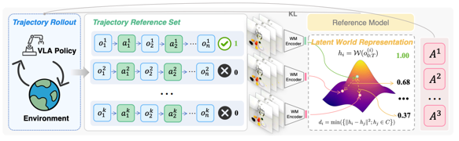                | [Github](https://github.com/sii-research/siiRL)           |
| 2025/11  | [LAOF: Robust Latent Action Learning with Optical Flow Constraints](https://arxiv.org/abs/2511.16407)                                                                                    |                 | [Github](https://github.com/XizoB/LAOF)                   |
| 2025/11  | [LatBot: Distilling Universal Latent Actions for Vision-Language-Action Models](https://arxiv.org/abs/2511.23034)                                                                        |               | -                                                         | 
| 2025/12  | [GLaD: Geometric Latent Distillation for Vision-Language-Action Models](https://arxiv.org/abs/2512.09619)                                                                                |                 | -                                                         |
| 2025/12  | [Latent Chain-of-Thought World Modeling for End-to-End Autonomous Driving](https://arxiv.org/abs/2512.10226)                                                                             |             | -                                                         |
| 2025/12  | [WholeBodyVLA: Towards Unified Latent VLA for Whole-Body Loco-Manipulation Control](https://arxiv.org/abs/2512.11047)                                                                    |       | [Github](https://github.com/OpenDriveLab/WholebodyVLA)    |
| 2025/12  | [Motus: A Unified Latent Action World Model](https://arxiv.org/abs/2512.13030)                                                                                                           |                | [Github](https://github.com/thu-ml/Motus)                 |
| 2025/12  | [LoLA: Long Horizon Latent Action Learning for General Robot Manipulation](https://arxiv.org/abs/2512.20166)                                                                             |                 | -                                                         |
| 2025/12  | [ColaVLA: Leveraging Cognitive Latent Reasoning for Hierarchical Parallel Trajectory Planning in Autonomous Driving](https://arxiv.org/abs/2512.22939)                                   |              | [Github](https://github.com/pqh22/ColaVLA)                |
| 2026/01  | [Learning to Act Robustly with View-Invariant Latent Actions](https://arxiv.org/abs/2601.02994)                                                                                          |                 | -                                                         |
| 2026/01  | [CLAP: Contrastive Latent Action Pretraining for Learning Vision-Language-Action Models from Human Videos](https://arxiv.org/abs/2601.04061)                                             |                 | -                                                         |
| 2026/01  | [LaST0: Latent Spatio-Temporal Chain-of-Thought for Robotic Vision-Language-Action Model](https://arxiv.org/abs/2601.05248)                                                              |                 | -                                                         |
| 2026/01  | [LatentVLA: Efficient Vision-Language Models for Autonomous Driving via Latent Action Prediction](https://arxiv.org/abs/2601.05611)                                                      |           | -                                                         |
| 2026/01  | [Fast-ThinkAct: Efficient Vision-Language-Action Reasoning via Verbalizable Latent Planning](https://arxiv.org/abs/2601.09708)                                                           |        | -                                                         |
| 2026/01  | [LangForce: Bayesian Decomposition of Vision Language Action Models via Latent Action Queries](https://arxiv.org/abs/2601.15197)                                                         |            | [Github](https://github.com/ZGC-EmbodyAI/LangForce)       |
| 2026/01  | [CARE: Multi-Task Pretraining for Latent Continuous Action Representation in Robot Control](https://arxiv.org/abs/2601.22467)                                                            |                 | -                                                         |
| 2026/01  | [Vision-Language Models Unlock Task-Centric Latent Actions](https://arxiv.org/abs/2601.22714)                                                                                            |               | -                                                         |
| 2026/02  | [Latent Reasoning VLA: Latent Thinking and Prediction for Vision-Language-Action Models](https://arxiv.org/abs/2602.01166)                                                               |             | [Github](https://github.com/LoveJu1y/LaRA-VLA)            |
| 2026/02  | [Recurrent-Depth VLA: Implicit Test-Time Compute Scaling of Vision-Language-Action Models via Latent Iterative Reasoning](https://arxiv.org/abs/2602.07845)                              |  | -                                                         |